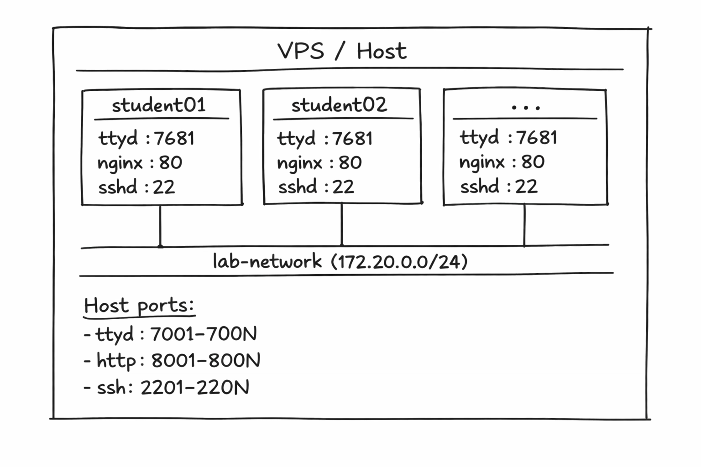

# Docker Computer Networks Lab

A Docker-based system for hands-on Computer Networks classes. Each student gets their own isolated container — a mini-VPS with a web terminal, SSH access, and a personal web server.

<p align="center">
  
</p>

## Tech Stack

<p align="center">
  
  
  
  
  
  
  
  
  
  
</p>

## Prerequisites

- **Docker** with Docker Compose v2 (`docker compose` command)
- **Python 3** with the `pyyaml` package
- A Linux VPS (x86_64) for deployment

```bash
# Install pyyaml if needed
pip3 install pyyaml
```

## Quick Start

```bash
# 1. Generate the lab for 20 students (default)
./lab.sh generate

# 2. Start all containers
./lab.sh up

# 3. Share credentials with students
./lab.sh credentials
```

That's it! Students can now access their environments through a browser.

## Port Mapping

Each student gets 3 dedicated ports. Example for a 5-student lab:

| Student    | Web Terminal (ttyd)      | Website (HTTP)           | SSH                          |
|-----------|--------------------------|--------------------------|------------------------------|
| student01 | `http://VPS_IP:7001`     | `http://VPS_IP:8001`     | `ssh -p 2201 student@VPS_IP`  |
| student02 | `http://VPS_IP:7002`     | `http://VPS_IP:8002`     | `ssh -p 2202 student@VPS_IP`  |
| student03 | `http://VPS_IP:7003`     | `http://VPS_IP:8003`     | `ssh -p 2203 student@VPS_IP`  |
| student04 | `http://VPS_IP:7004`     | `http://VPS_IP:8004`     | `ssh -p 2204 student@VPS_IP`  |
| student05 | `http://VPS_IP:7005`     | `http://VPS_IP:8005`     | `ssh -p 2205 student@VPS_IP`  |

## CLI Reference

All management is done through `lab.sh`:

```bash
./lab.sh generate [N] [flags]   # Generate config for N students (default: 20)
./lab.sh up                     # Build and start all containers
./lab.sh down                   # Stop and remove everything (cleanup)
./lab.sh reset                  # Full restart (down + up)
./lab.sh status                 # Show container status
./lab.sh credentials            # Display student credentials
./lab.sh logs [container]       # View logs (all or specific)
./lab.sh shell <container>      # Enter container as root (professor)
```

### Generate Options

```bash
# 25 students with individual random passwords
./lab.sh generate 25

# 10 students with a single shared password (auto-generated)
./lab.sh generate 10 -s

# 10 students with a specific shared password
./lab.sh generate 10 -s mypassword

# Custom base ports
./lab.sh generate 15 --base-ssh 3000 --base-http 9000 --base-ttyd 6000
```

### Professor Access

Enter any container as root for troubleshooting:

```bash
./lab.sh shell student01
```

## What Students Get

Each container includes:

| Category   | Tools                                                    |
|------------|----------------------------------------------------------|
| Networking | `ping`, `traceroute`, `nmap`, `tcpdump`, `curl`, `wget`, `dig`, `ip`, `netcat`, `iptables`, `ifconfig` |
| Editors    | `vim`, `nano`                                            |
| Languages  | `python3`                                                |
| Web Server | `nginx` (editable at `/var/www/html/`)                   |

Containers have `NET_ADMIN` and `NET_RAW` capabilities, allowing students to use `tcpdump`, `iptables`, and raw sockets.

## Student Instructions

Share this with your students:

> **Your Lab Environment**
>
> - **Web Terminal**: Open `http://SERVER:PORT` in your browser (credentials provided by your professor)
> - **Your Website**: Edit `/var/www/html/index.html` and view it at `http://SERVER:PORT`
> - **SSH** (optional): `ssh -p PORT student@SERVER`
>
> **Try these commands:**
> ```bash
> # See your network configuration
> ip addr show
>
> # Ping another student's container
> ping student02
>
> # Capture network packets
> tcpdump -i eth0
>
> # Scan the lab network
> nmap 172.20.0.0/24
>
> # Edit your website
> nano /var/www/html/index.html
> ```

## Resource Limits

Each container is limited to:
- **256 MB** RAM
- **0.5** CPU cores

These defaults keep 20 containers comfortable on a 4GB/4-core VPS.

## Suggested Lab Activities

1. **Network Discovery**: Use `nmap` to discover other students on the network
2. **Packet Analysis**: Run `tcpdump` while pinging another student, analyze the ICMP packets
3. **DNS Investigation**: Use `dig` to query DNS records for various domains
4. **Firewall Rules**: Configure `iptables` to block/allow specific traffic
5. **Web Server Setup**: Edit the Nginx page and serve a custom website
6. **Client-Server**: Write a Python chat server, have another student connect with `netcat`
7. **Routing**: Use `traceroute` to explore network paths
8. **HTTP Analysis**: Use `curl -v` to inspect HTTP headers and responses

## Generated Files

Running `./lab.sh generate` creates these files (git-ignored):

| File                  | Description                                |
|----------------------|---------------------------------------------|
| `docker-compose.yml` | Docker Compose config with all containers   |
| `credentials.txt`    | Human-readable credentials table            |
| `credentials.json`   | Machine-readable credentials (JSON array)   |

## Troubleshooting

**Containers won't start**
- Check if ports are already in use: `ss -tlnp | grep 7001`
- Ensure Docker is running: `docker info`

**ttyd shows blank page**
- Wait a few seconds after `./lab.sh up` for services to initialize
- Check logs: `./lab.sh logs student01`

**Student can't edit their website**
- The `/var/www/html/` directory is owned by `student` — should work out of the box
- Verify: `./lab.sh shell student01` then `ls -la /var/www/html/`

**Containers can't ping each other**
- All containers share the `lab-network` bridge — this should work automatically
- Check: `docker network inspect dockers-students_lab-network`

**Building on Apple Silicon (ARM64)**
- The Dockerfile downloads the x86_64 ttyd binary
- For local testing on ARM: `docker buildx build --platform linux/amd64 .`
- On an x86_64 VPS this is not an issue

## Testing

```bash
# Unit tests (no Docker required)
pip3 install pytest pyyaml
python3 -m pytest tests/test_generate_lab.py -v

# Integration tests (requires Docker)
bash tests/test_integration.sh
```

## Project Structure

```
.
├── Dockerfile              # Container image (Ubuntu 24.04 + tools)
├── entrypoint.sh           # Startup script (configures SSH, passwords, launches services)
├── supervisord.conf        # Process manager for sshd, nginx, ttyd
├── default_index.html      # Default student web page
├── generate_lab.py         # Generates docker-compose.yml + credentials
├── lab.sh                  # Management CLI
├── tests/
│   ├── test_generate_lab.py    # Unit tests (pytest)
│   └── test_integration.sh     # Integration tests (Docker)
└── README.md
```

## License

This project is licensed under the [MIT License](LICENSE).
